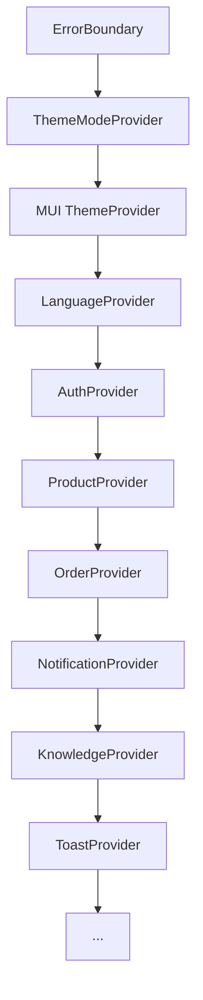

# Project Architecture 🏗️

This document explains the technical structure and design patterns used in the Rural Entrepreneurship Platform.

## 🌳 Context Provider Tree

The application follows a deeply nested Provider pattern to manage global state across different domains. The order ensures that lower-level providers have access to high-level configurations (like Theme or Auth).

## 🛠️ Service Layer Pattern

We use a centralized service layer ([src/services/](file:///c:/Users/sivag/Desktop/resum-detailes/hackthon-projects/pune_hack/Rural-Entrepreneurship-Platform/src/services/)) to abstract data fetching.

- **Centralized API**: `src/utils/api.js` defines the Axios instance with interceptors.
- **Demo Toggle**: Each service checks `APP_CONFIG.isDemo`.
  - **Demo Mode**: Uses `secureStorage` to persist data in `localStorage`.
  - **Production Mode**: Makes real REST API calls via Axios.
- **Benefit**: Components/Contexts only call `productService.getAll()`, unaware of whether data comes from a server or local storage.

## 🚀 Adding a New Feature

Follow these steps to add a new domain (e.g., "Farmer Tools"):

1.  **Define the Service**: Create `src/services/toolService.js` with demo/prod toggle.
2.  **Create a Context**: Create `src/contexts/ToolContext.jsx` to manage state and expose service methods to the UI.
3.  **Wrap the App**: Add the new `ToolProvider` to the provider tree in `App.jsx`.
4.  **Build Components**: Create functional components in `src/components/farmer/` or `src/pages/`.
5.  **Add Routing**: Register the new routes in `App.jsx`.

## 📦 Data Persistence Design

- **Local Storage**: All demo data is stored under the `secureStorage` utility which encodes values to Base64 to prevent casual tampering.
- **Versioning**: Each session is tracked with a `loginAt` and `expiresAt` timestamp in `AuthContext`.

---

For API specific contracts, see [src/api/README.md](file:///c:/Users/sivag/Desktop/resum-detailes/hackthon-projects/pune_hack/Rural-Entrepreneurship-Platform/src/api/README.md).
